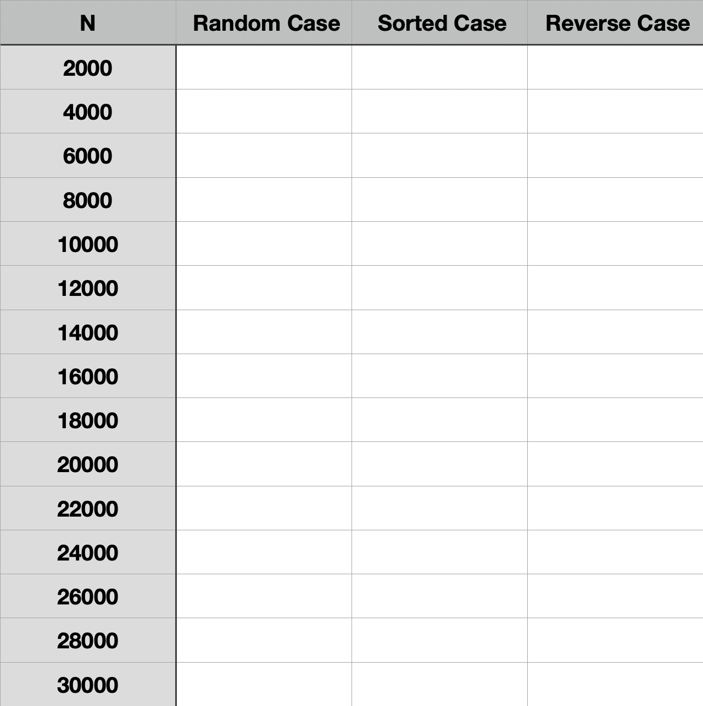
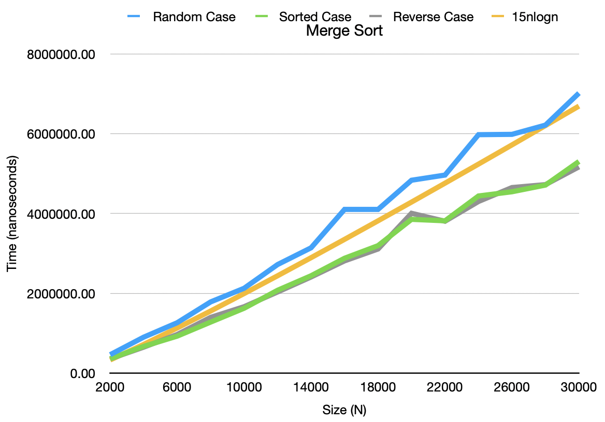
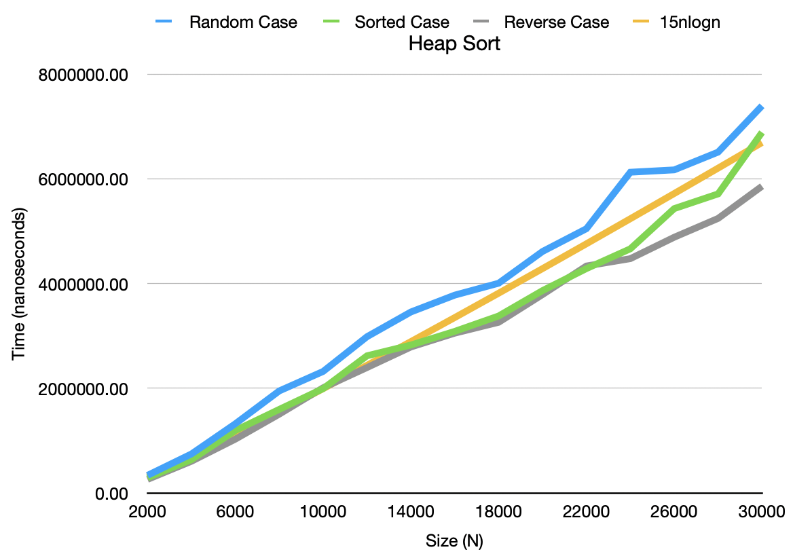
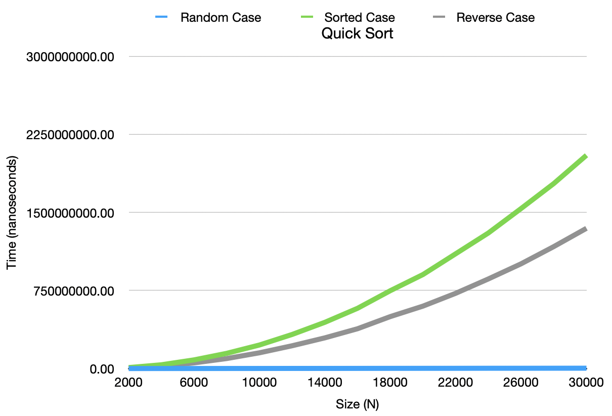
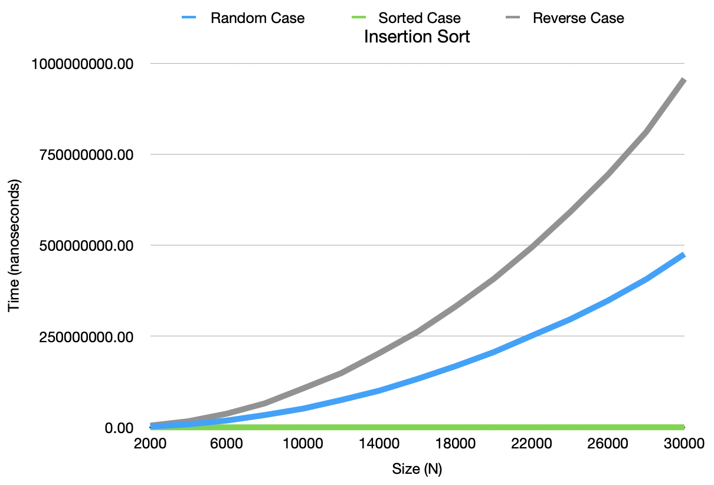
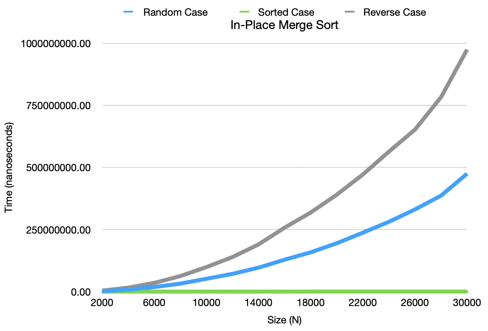

&copy; [Reese Barnett](www.linkedin.com/in/reesebarnett2024)

# Multi-Sort Analysis

###### Note: Timings carried out on a MacBook Pro (15-inch, 2019) with 2.3GHz 8-Core Intel Core i9 CPU and 16GB of 2400 MHz DDR4 memory.

---

## Purpose

Why are there so many algorithms for the same task? Algorithms vary by how quickly they run and the amount of resources they use. Two sorting algorithms can produce the same output but may vary by their runtimes, resource use, or both. An algorithm's run time and space usage is often expressed as a function of the input size, using Big O notation. The Big O notation for an algorithms runtime is called the _**time complexity**_, likewise the Big O notation for an algorithm's resource use is called the _**space complexity**_. The purpose of this project is to calculate the time complexities of _**Merge Sort**_, _**Heap Sort**_, _**Quick Sort**_, _**Insertion Sort**_, and _**In-Place Merge Sort**_ with input arrays of various sizes and element orders.

---

## Development Info

The Multi-Sort Analysis is conducted by a single developer, [Reese Barnett](https://www.linkedin.com/in/reesebarnett2024). Barnett is responsible for all the code. This project uses an iterative development process called _**Agile**_ that allows Barnett to evolve requirements and solutions over the lifetime of the application.

- Developer(s): [Reese Barnett](https://www.linkedin.com/in/reesebarnett2024)
- Programming Technologie(s): CLion, chrono, climits, cmake
- Language(s): C++

---

## Procedure

#### Setup

- Each algorithm will be timed on how long it takes to sort a specific input array into ascending order. Input arrays have two attributes: size and order of elements. The size of the array, N, is the number of integers in the array. N ranges from 2,000 to 30,000 (inclusive) by 2,000 increments. The order of the elements in the input array can be random, sorted (ascending order), and reverse sorted (descending order).

#### Execution

- All five sorting algorithms are tested on the same 45 distinct input arrays ({N=2,000 , Random}, {N=2,000 , Sorted}, ... , {N=30,000 , Reversed}). This means the input array with 22,000 integers in random order is the same array that all five sorting algorithms will be tested on. The sorting algorithms will sort an input array 10 times and the average time will be recorded.

---

## Results

#### Merge Sort

#### Heap Sort

#### Quick Sort

#### Insertion Sort

#### In Place Merge Sort

---

## Analysis

From the data collected Barnett concluded:

###### Merge Sort:

| Random     | Sorted     | Reverse    |
| ---------- | ---------- | ---------- |
| O(nlog(n)) | O(nlog(n)) | O(nlog(n)) |

###### Heap Sort:

| Random     | Sorted     | Reverse    |
| ---------- | ---------- | ---------- |
| O(nlog(n)) | O(nlog(n)) | O(nlog(n)) |

###### Quick Sort:

| Random     | Sorted           | Reverse          |
| ---------- | ---------------- | ---------------- |
| O(nlog(n)) | O(n2) | O(n2) |

###### Insertion Sort:

| Random           | Sorted | Reverse          |
| ---------------- | ------ | ---------------- |
| O(n2) | O(n)   | O(n2) |

###### In Place Merge Sort:

| Random           | Sorted     | Reverse          |
| ---------------- | ---------- | ---------------- |
| O(n2) | O(nlog(n)) | O(n2) |
